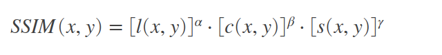
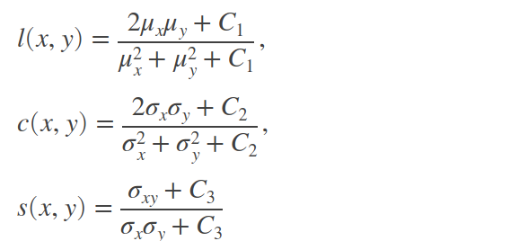
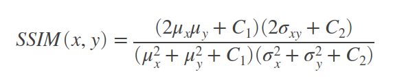

# Image Quality Measure Tools

## SSIM

SSIM(Structural Similarity Index) assesses the visual impact of three characteristics of an image: luminance, contrast and structure.

where 

where 
`μx`, `μy`, `σx,σy`, and `σxy` are the **local means**, **standard deviations**, and **cross-covariance** for images x, y. 

If `α = β = γ = 1` (the default for Exponents), 

and `C3 = C2/2 (default selection of C3)` the index simplifies to:

